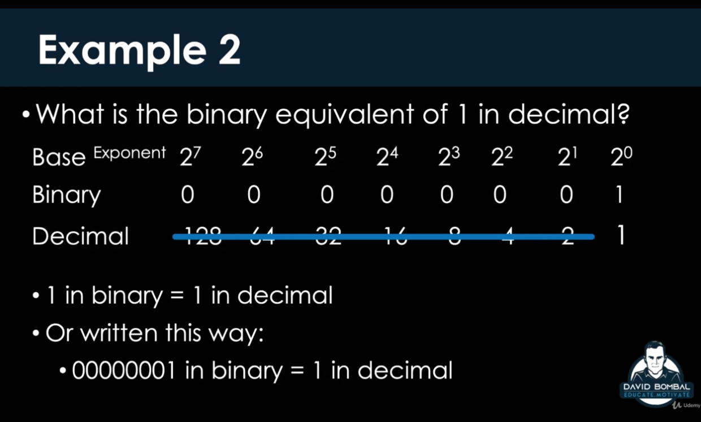
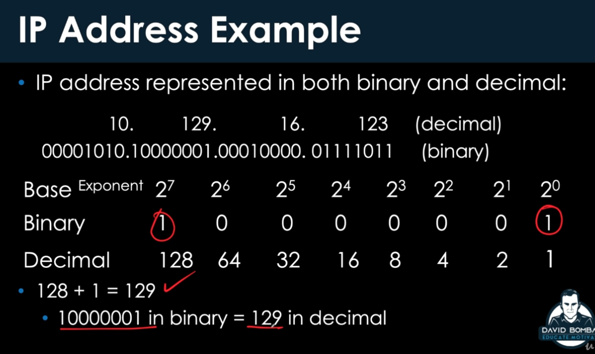
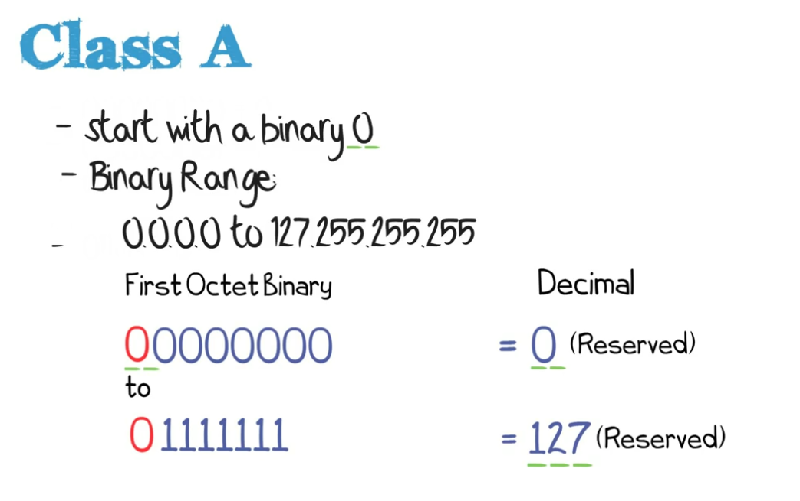

# Udemy - The Complete Networking Fundamentals Course. Your CCNA start 2020-7

# The Distance Between YOur Dreams and Reality is Called Persistance.

**if you continue you will get it you will understand it** 

# Basic Networking Terms

## what is network ?

**why do we have computer networks?**

**what's the whole point of the internet?**

**answer : sharing resources**

**now what is a resource ?**

in the old days a common example of a resource would be a printer

or another example would be a file or video. you can share file resources whit USB but it's much easier just to share files using a digital transmission mechanism 

 

**computing device :** laptop, macbook, phone, server, printer

## most basic type of network

the internet is the biggest network that we have on earth today.
a small network would simply consist of 2 computers.

**wifi an example of using the air for transmission of data from one device to the other instead of using cable(RJ45)**

## a bit of networking history

**internet start with 10base5 cabling**

## servers, clients, ports, protocols

a server is providing a service or functionality ot clients in what's called a client server model.

client is a piece of computer hardware or software that accesses a service made available by a server.
the server is often on another computer system, in which case the client accesses the service by way of a network.

**the whole idea of a server is to provide resources or functionality to clients**

**a client device such as a laptop can act as a server**

now a server, will be listening on different prot numbers for different protocols.

**protocol basically a set of rules used for communication between devices.**

**server has to listen on specific prot numbers for specific protocols.**

## Networking Devices Repeaters, Hubs, Switches, Routers

**repeaters => hubs => bridges(learns MAC addresses in software) => switch(learns MAC addresses mu ch more quickly by using hardware ASICs Application Specific Integrated Circuits)**

1. **hub**: repeats the signal without understanding what's going on, work on layer 1.

**a wifi network or a wireless network is essentially a hub in the air**

2. **switch**: a switch actually reads the frames received on ethernet, so uses a MAC address table, and only forward the frames out of the correct port.and uses for local network(LAN) or vLAN(virtual local network), route from one subnet to another. and work on layer 2.

the big difference between a switch and a hub is a switch has intelligence.

so that's one of the features of switches they allow us to connect many devices in our local area network.

3. **routers** which use IP addresses to route from one network to another network, layer 3.

**typically little routes like(my home modem) allow us to go from our LAN onto the internet(WAN)**

## Firewalls

**firewall in front of the router**
 

**firewall behind of the router**
 

if i have 100 access points for manage them, they would connect to the Wireless LAN controller.

---------------------

# TCPIP Model

 
 

how many layers are there in networking? OSI or TCPIP Model.

people in the real world are saying the OSI model is rubbish. other people say's no OSI model is required. 

**you need to know both the OSI model and TCPIP model but concentrate on the TCPIP model**
 

**the TCPIP protocol is what we use in the real world**

**so now in the new version of the CCNA we have what these called hybrid model or combined model of OSI and TCPIP model**
[ipspace](https://www.ipspace.net/Main_Page)

### RFC
**RFC allow us to agree on what protocol will be implemented by different vendors**

 

## Bits, Frames, Packets, Segments

 

on ethernet devices communicate using MAC address, and MAC addresses are burnt in address on a network interface card.

**ARP** resolution protocol requesting the MAC address, (so basically saying who has this IP address)

**TCp packet, so in TCP before communication takes place they do three way handshake**

how does one layer referred to the layer above it ?

at layer 2 on ethernet it uses a type field

when a device receives a frame at layer 2 it needs to know which protocol to use... in other words is it an IPv4 packet or is it an IPv6 packet? it's based on the type field at layer 2

> The "Type" field in Ethernet II frames tells the OS what kind of data the frame carries – 0x0800 means that the frame has an IPv4 packet; there's a list of different EtherTypes.

[answer](https://superuser.com/a/423281)

 

-------------------------

# Binary

**2^n** = number of binary values

 
 
 

 

 

**octet**

 

**ipv4** = 4 octet

**192.168.2.16** = 8bits . 8bits . 8bits .8bits

 

**IP Address Example**

 

------------------

# Hexadecimal 

**ARP is used to find the MAC address of another device in the network it's basically broadcast sent out into the network saying who has this IP address and that device will reply back with its MAC address**

 

 

 

`ipconfig /all` in windows show MAC address

`arp -a` show MAC address

**some cisco switches command**

1. `en` takes us to privilege mode
2.  `show mac address-table`

-----------------------

# IP Addressing

## what is an IP Address

 

**a lot of web sites don't permit PING which uses ICMP so the request times out, but the DNS server resolve**

**`nslookup` just does a DNS resolution of a domain name rather than trying to ping the server**

**IP Characteristics**

 

 

## Network vs Host Portion

 

## IPv4 format

 

**IPv4 classes**

 

**Class A**

 

 

**Class B**

 

 

**Class C**

 

 

**Class D**

**Multicast** one device has talking to a group of devices

 

**Class E**

**Reserved classes for broadcast**

 

## summary

 
 
 

## Directed Broadcast Address

 

**CPU of every device will be interrupted to process the directed broadcast**

 

## Local Broadcast Address

 

## Local Loopback Address

 

## Private Address

**Essentially a lot of the information that we're studying in networking, comes originally form RFCs**

**RFC1149 describe IP**

**RFC1948 Private IP**

 

7-10